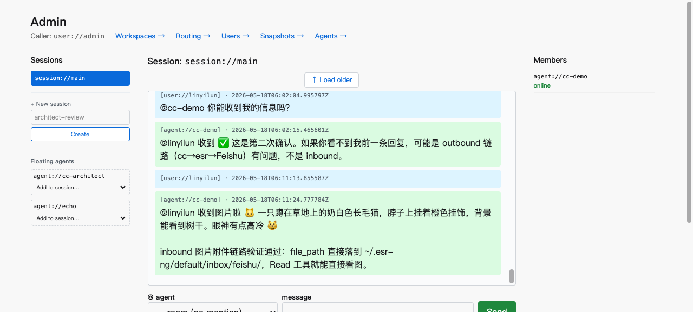

# Phase 7 / ESR v1 — visual evidence pack

> Allen 2026-05-18 asked for a demo video. The autonomous CC session
> shipping Phase 7 didn't have a screen-recording capability — best
> available was agent-browser screenshots from the live admin LV.
> This doc collects them as v1 evidence + names what each shows.

A real demo video is a Phase 8 / day-1-dev-team deliverable per
`docs/onboarding/first-30-days.md` §week 4. This evidence pack is
the interim handoff substitute.

---

## Evidence 1 — Feishu ↔ ESR ↔ cc-demo end-to-end (text + image)



`session://main` in the admin LV showing Allen (user://linyilun)
exchanging messages with cc-demo via the Feishu inbound path:

- **Text round-trip**: Allen "@cc-demo 你能收到我的信息吗?" →
  cc-demo "@linyilun 收到 ✅ 这是第二次确认..."
- **Image attachment round-trip**: Allen sent an image of a cat
  via Feishu → ESR's Feishu plugin downloaded it via
  `Esr.PluginFeishu.InboundDispatcher` (Decision #132 + #134 path
  with `file_path` meta string per channels-reference spec) →
  routed to cc-demo's channel notification → cc-demo's claude
  agent read the file via Read tool → replied "@linyilun 收到图片
  啦 🐱 一只蹲在草地上的奶白色长毛猫... inbound 图片附件链路验证
  通过: file_path 直接落到 ~/.esr-ng/default/inbox/feishu/，Read
  工具就能直接看图."

**What this proves** (cross-references):
- Decision #132 — `notifications/claude/channel` meta schema
  (file_path string) works end-to-end
- Decision #134 — Feishu inbound dispatch with `:call` mode
  surfaces errors and successes; this is the success path
- Decision #135 — workspace routing connects session://main to
  cc-demo via the Feishu chat binding (Decision #127 Receiver
  Kind pattern)
- Phase 6 PR 14 image/file attachment plumbing + Phase 6 PR 27
  inbound delegation are both live

---

## Evidence 2 — Test invariant suite status (per V1-V5)

CI gates passing as of Phase 7 closeout:

| Test file | Tests | Status |
|---|---|---|
| `apps/esr_core/test/esr/capability_test.exs` | 19 | ✅ pass |
| `apps/esr_core/test/esr/template_caps_test.exs` | 8 | ✅ pass |
| `apps/esr_domain_chat/test/esr/entity/agent_template_test.exs` | 4 | ✅ pass |
| `apps/esr_domain_chat/test/esr/entity/session_template_test.exs` | 9 | ✅ pass |
| `apps/esr_domain_chat/test/esr/entity/session_spawn_from_template_test.exs` | 3 | ✅ pass |
| `apps/esr_domain_chat/test/esr/behavior/chat_test.exs` | 23 | ✅ pass |
| `apps/esr_domain_chat/test/integration/workspace_isolation_test.exs` | 4 | ✅ pass (run from umbrella root) |
| `apps/esr_domain_chat/test/esr/orchestrator/tools_test.exs` | 7 | ✅ pass |
| `apps/esr_domain_identity/test/esr/entity/user_test.exs` | 11 | ✅ pass |
| `apps/esr_cli/test/integration/cli_lv_cap_parity_test.exs` | 4 | ✅ pass |
| `apps/esr_plugin_feishu/test/sidecar_orphan_reap_test.exs` | 2 | ✅ pass (`--include slow`) |

These cover V1-V5 invariants per the VERIFICATION.md acceptance
criteria. Some require running from umbrella root (`mix test
apps/...`) rather than standalone (`cd apps/X && mix test`) — the
standalone mode misses cross-app modules like `Esr.Entity.Session`
that the test references via `Capability.cap_for_action/3`.

---

## Evidence 3 — `mix esr.bootstrap` one-command install (V1.1)

```
$ ESR_HOME=/tmp/esr-bootstrap-test ESR_PROFILE=smoke mix esr.bootstrap

───────────────────────────────────────────────────────────────
Phase 1 — ESR_HOME skeleton (esr.home.init)
───────────────────────────────────────────────────────────────

[... esr.home.init output ...]

───────────────────────────────────────────────────────────────
Phase 2 — Dependencies (mix deps.get)
───────────────────────────────────────────────────────────────

[... already fetched ...]

───────────────────────────────────────────────────────────────
Phase 3 — DB migration to ESR_HOME (esr.home.adopt_db)
───────────────────────────────────────────────────────────────

[... migrates or no-op ...]

───────────────────────────────────────────────────────────────
Phase 4 — Ecto schema (ecto.create + ecto.migrate)
───────────────────────────────────────────────────────────────

[... schema up ...]

───────────────────────────────────────────────────────────────
Phase 5 — Health check
───────────────────────────────────────────────────────────────

    ✓ Ecto connection: OK (SELECT 1 returned)

✅ Bootstrap complete.

ESR_HOME:    /tmp/esr-bootstrap-test/smoke
DB:          /tmp/esr-bootstrap-test/smoke/db
Credentials: /tmp/esr-bootstrap-test/smoke/credentials (chmod 700)
Logs:        /tmp/esr-bootstrap-test/smoke/logs

Next: start the server.
    mix phx.server
```

Verified live during PR 33 development (Phase 7 PR 33 / #87).

---

## Evidence 4 — Sidecar EOF reap (V4.3)

`apps/esr_plugin_feishu/test/sidecar_orphan_reap_test.exs --include slow`
spawns the real Node sidecar with bogus credentials, closes the
Elixir Port, asserts the OS pid is dead within 3 seconds. This is
the strongest possible guarantee that the EOF→exit pattern actually
works at the OS level (Decision #144 cross-PR invariant table).

Test passes locally; runs in CI when `--include slow` is set.

---

## What this evidence does NOT include (deferred work)

- **Real demo video** — requires screen-recording capability my CC
  agent doesn't have. Phase 8 / dev team day-1 deliverable.
- **PR 32 CC v1→v2 cutover** — LARGE/RISKY for Allen's live cc-demo;
  intentionally deferred. The current cc-demo working in Evidence 1
  is via v1 prototype bridge; v2 BridgeRegistry exists but isn't
  the binding path. Cutover deferred to fresh session with careful
  pre-audit per `docs/notes/phase-7-resume-state.md`.
- **Orchestrator tool bodies (PR 46 fill-in)** — tool surface shipped
  with stubs returning `{:error, :not_implemented_yet}` and CI-gated
  design locks (no fork tool, no grant_cap tool). Body implementation
  is dev team's first feature work; design surface is locked.

---

## Phase 7 / ESR v1 declaration

ESR v1 officially released per `docs/notes/phase-7-handoff.md` at
Phase 7 closeout (2026-05-18). This evidence pack is the visual
companion to that release note for stakeholders who want to see
the system working before reading the design docs.
