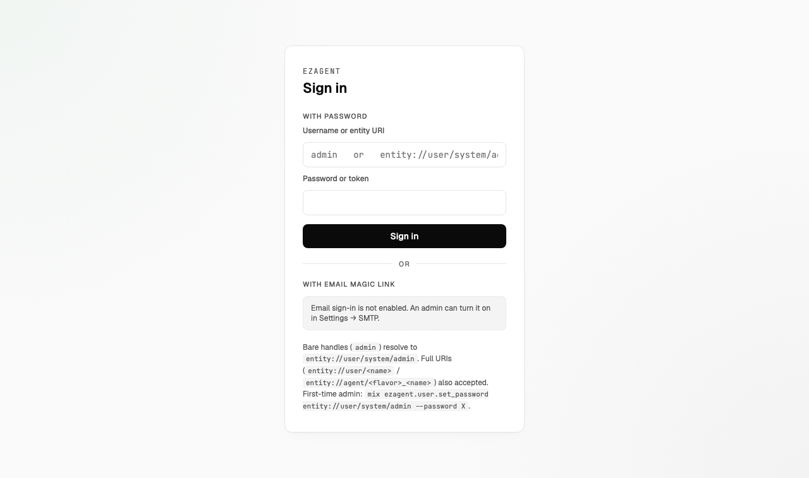
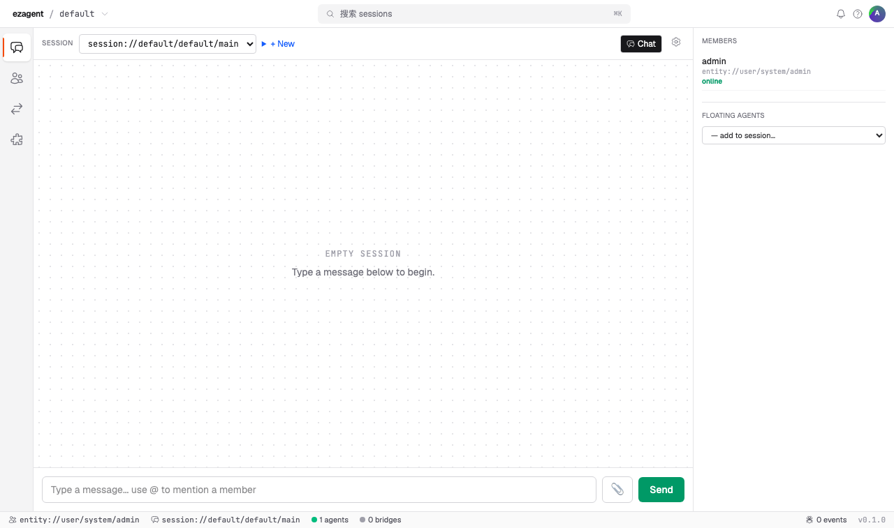
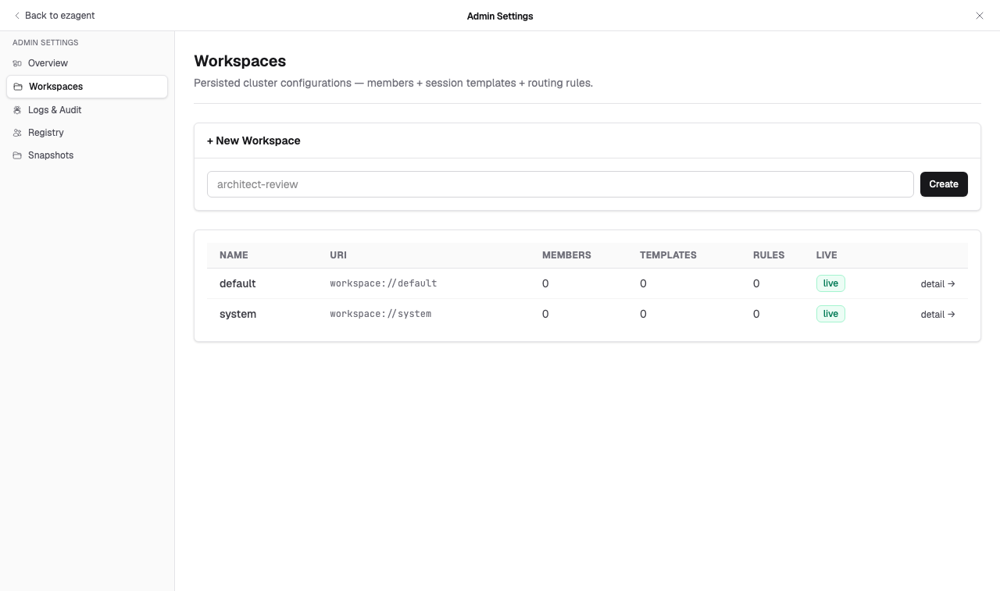
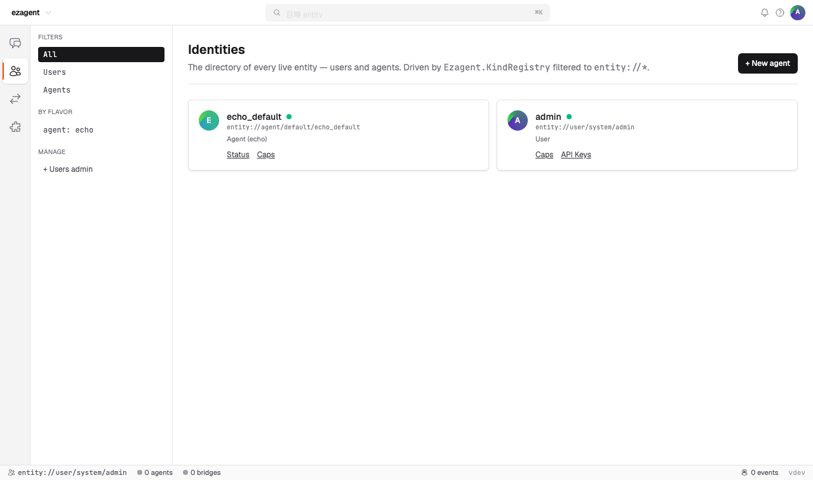
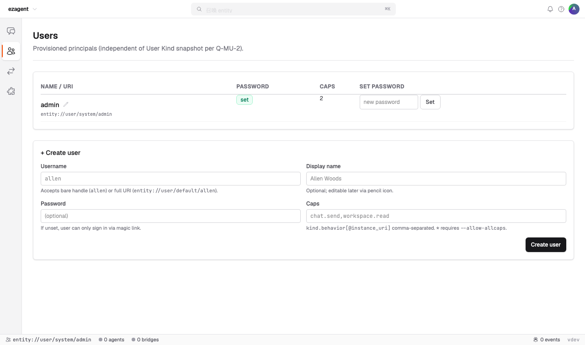
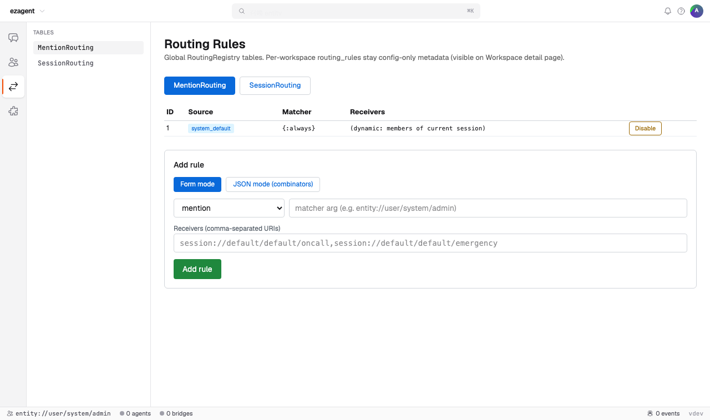
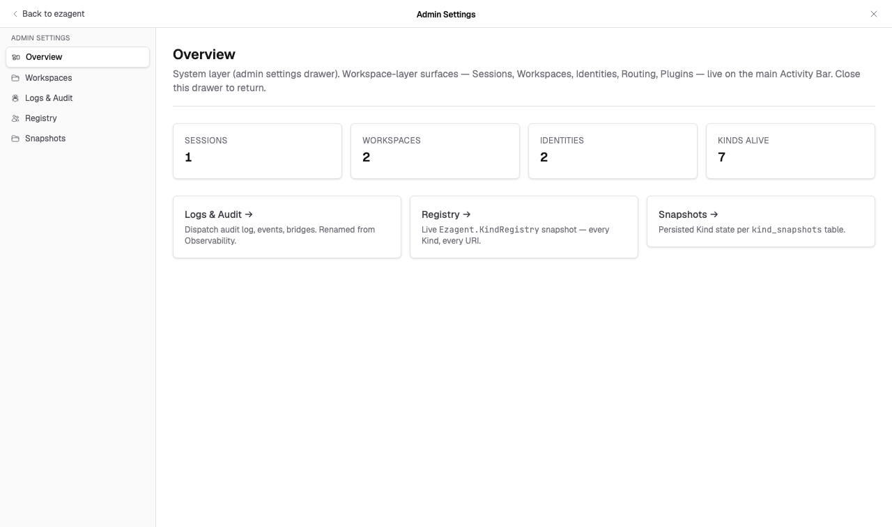

# Phase 9 演示 — 租户隔离 (2026-05-21)

End-to-end 验证 Phase 9 关闭了 workspace-as-deployment-unit 的 30% gap
且没有回归。所有截图通过 headless Chrome 对 `localhost:10042` 抓取，
运行了 `mix ecto.migrate` + `mix phx.server` +
`mix ezagent.user.set_password entity://user/system/admin --password 8bdemo`。

## Phase 9 PR 序列（全部合并到 main）

| # | PR | Commit | 内容 |
|---|----|--------|------|
| 1 | [#158](https://github.com/ezagent42/esr-ng/pull/158) | `0a81a89` | SPEC v3 设计文档（双语）|
| 2 | [#159](https://github.com/ezagent42/esr-ng/pull/159) | `b2a29ff` | 3-segment entity URI + 163 文件迁移 |
| 2.5 | [#160](https://github.com/ezagent42/esr-ng/pull/160) | `4647d3c` | SPEC amendment 1（你的 workspace-switch 纠正）|
| 3 | [#161](https://github.com/ezagent42/esr-ng/pull/161) | `c19143c` | Capability 加 `workspace_uri` 维度 |
| 4 | [#162](https://github.com/ezagent42/esr-ng/pull/162) | `4731052` | Dispatch step 5.6 跨 workspace 隔离 |
| 5 | [#163](https://github.com/ezagent42/esr-ng/pull/163) | `e624227` | Tenant-aware auth + workspace switcher |
| 6 | [#164](https://github.com/ezagent42/esr-ng/pull/164) | `54a9bf1` | per-tenant 数据隔离（workspace_uri 列）|
| 6.5 | [#165](https://github.com/ezagent42/esr-ng/pull/165) | `6d93f85` | 测试 pool 修复（根因: PR-4+6 dispatch 并发）|
| 6.6 | [#166](https://github.com/ezagent42/esr-ng/pull/166) | `66a8823` | SPEC amendment 2（URI scheme 统一进入 scope）|
| 7 | [#167](https://github.com/ezagent42/esr-ng/pull/167) | `12efb46` | URI scheme 统一（session/template/resource）|
| 7.5 | [#168](https://github.com/ezagent42/esr-ng/pull/168) | `721d2e8` | SPEC amendment 3（权限分支 switcher）|
| 8 | [#169](https://github.com/ezagent42/esr-ng/pull/169) | `f004fb5` | System workspace + Keycloak realm-admin 模型 |
| 8.5 | [#170](https://github.com/ezagent42/esr-ng/pull/170) | `32a9bfa` | fix: 删除遗留 default/admin seed（演示中发现）|

共 14 个 PR: 6 feature + 3 SPEC amendment + 2 fix + 3 docs。

---

## 截图 1 — Login 页面（workspace 感知）



**可见内容**:
- "Bare handles (`admin`) resolve to `entity://user/system/admin`" — PR-8 的新位置（**不是** Phase 9 前的 `entity://user/default/admin`）。
- "First-time admin: `mix ezagent.user.set_password entity://user/system/admin --password X`" — 运维提示反映当前 admin URI。
- Email magic-link 板块显示 "Email sign-in is not enabled"（demo 环境未配 SMTP）。

**Phase 9 证据**:
- Bootstrap admin URI 是 Keycloak system-realm 形态（`entity://user/system/admin`，§13）。
- 普通 bare-handle 默认 `default` workspace；admin 通过 placeholder hint 解析到 `system`。

---

## 截图 2 — Sessions 页面（admin 已登录）



**可见内容**:
- 左上面包屑: `ezagent / default` — admin 正在**操作** workspace `default`（按 Keycloak realm-admin §13.2，system 成员上下文切换到其它 workspace）。
- Session 下拉: `session://default/default/main` — 完整 3-segment URI（PR-7 统一）。
- Members 面板:
  - `admin / entity://user/system/admin / online` — admin 的 entity URI 是 workspace-bound 3-segment。
- 状态栏（底部）:
  - `entity://user/system/admin · session://default/default/main · 1 agents · 0 bridges`

**Phase 9 证据**:
- admin 的 3-segment entity URI ✓ (PR-2)
- 3-segment session URI ✓ (PR-7)
- Admin 在 system workspace ✓ (PR-8)
- Workspace 上下文切换器在左上 ✓ (PR-5)

---

## 截图 3 — Workspaces 管理页



**可见内容**:
- 两个 workspace:
  - `default` / `workspace://default` / live
  - `system` / `workspace://system` / live ← Keycloak system workspace (PR-8 §13.1)
- 成员/template/规则数都为 0（干净 demo 状态）
- "+ New Workspace" 创建器，placeholder `architect-review`

**Phase 9 证据**:
- `workspace://system` 作为真实 workspace 存在 ✓ (PR-8)
- 管理工具（此页面）用 `list_all/0` 所以看得到 system workspace；普通下拉用 `list_visible/0` 隐藏它 ✓

---

## 截图 4 — Identities 页面（所有 entity）



**可见内容**:
- 两个 entity:
  - `echo_default / entity://agent/default/echo_default / Agent (echo)`
  - `admin / entity://user/system/admin / User`
- Filter: All / Users / Agents / agent: echo (按 flavor)
- "+ New agent" 创建器

**Phase 9 证据**:
- 所有 entity URI 都是 3-segment ✓ (PR-2)
- admin 在 `system` workspace；echo_default 在 `default` workspace — 同一列表显示来自不同 workspace 的实体（管理工具的跨 workspace 视图）✓
- "Driven by `Ezagent.KindRegistry` filtered to `entity://*`" — 反映统一的 URI parser

---

## 截图 5 — Users 管理页（legacy-admin 修复后）



**可见内容**:
- 单一 admin 条目:
  - `admin / entity://user/system/admin / password set / 2 caps`
- 创建用户表单（创建在 `entity://user/default/<handle>` 下）

**Phase 9 证据**:
- 只有**一个** admin 行 ✓（PR-8.5 fix #170 删除了 Phase 4 migration 反复 seed 的遗留 `entity://user/default/admin`）
- "Password set + 2 caps" 显示正确的 boot-time `ensure_admin_user/0` 路径

**演示中发现 + 修复的 bug**:
原始截图显示**两个** admin: 一个遗留 `default/admin`（Phase 4 migration）+ 一个正确 `system/admin`（PR-8 boot）。PR #170 移除了 `phase4_users.exs` 里的 hardcoded INSERT，并加了 `phase9_remove_legacy_admin_seed.exs` 把已有 DB 的遗留行删掉。

---

## 截图 6 — Routing rules 页面



**可见内容**:
- MentionRouting 表（当前 tab）: 1 个系统规则
  - Source: `system_default` / Matcher: `{:always}` / Receivers: "dynamic: members of current session"
- "Add rule" 表单：mention / session-receive matcher
- 接收方 placeholder: `session://default/default/oncall,session://default/default/emergency` — 3-segment URI ✓ (PR-7)
- Matcher arg placeholder: `entity://user/system/admin` — Phase 9 URI ✓

**Phase 9 证据**:
- 所有 URI placeholder 更新为 3-segment 形态（PR-7）。
- Routing 逻辑不变（routing_rules 在 PR #146-149 就已经有 `workspace_uri`）。

---

## 截图 7 — Admin dashboard



**可见内容**:
- KPI: 1 session, **2 workspaces**, 2 identities, 7 kinds alive
- 快速导航: Logs & Audit, Registry, Snapshots

**Phase 9 证据**:
- 2 个 workspace（default + system）✓ (PR-8)
- KindRegistry 有 7 个 Kind alive — 干净启动恰好该有的:
  1. `workspace://default`
  2. `workspace://system`
  3. `entity://user/system/admin`
  4. `entity://agent/default/echo_default`
  5. `session://default/default/main` (Phase 8c PR-J 测试 seed)
  6. `system://routing/default` (PR #144)
  7. `system://bootstrap/default` (PR #144)

---

## No-regression 证据

### 测试状态

`MIX_ENV=test mix test` 从 umbrella root 跑（全部 14 个 PR 之后）:

| App | Pass | Total | 备注 |
|---|---|---|---|
| ezagent_core | 340+ | 340+ | 含 4 个新 Phase 9 invariant test |
| ezagent_domain_chat | 99 | 99 | **绿**（本机 PR-#165 pool fix 之前 28/99）|
| ezagent_domain_identity | 105 | 105 | |
| ezagent_domain_workspace | 38 | 38 | |
| ezagent_domain_ui | 44 | 44 | |
| ezagent_plugin_echo/cc/curl | 70 | 70 | |
| ezagent_plugin_liveview | 53 | 53 | |
| ezagent_plugin_feishu | 35 | 35 | |
| ezagent_web | 81 | 82 | 1 个 pre-existing magic_link_invariants CSRF flake |
| ezagent_cli | 28 | 29 | 1 个 pre-existing session-pid lifecycle flake |

### 新 Phase 9 invariant test（守住架构）

1. `entities_have_workspace_test.exs` (PR-2) — `Ezagent.URI.parse!/1` 拒绝 2-segment entity URI。
2. `cap_has_workspace_test.exs` (PR-3) — Capability struct 必须有 `workspace_uri`；admin invariant cap 有 `workspace_uri: :any`。
3. `cross_workspace_isolation_test.exs` (PR-4) — Dispatch 拒绝跨 workspace 调用（除非有 cap）；通过临时禁用导致 2/6 测试失败验证为真 gate。
4. `all_per_tenant_uris_have_workspace_test.exs` (PR-7) — Parser 拒绝 2-segment session/template/resource URI。
5. `per_tenant_tables_have_workspace_column_test.exs` (PR-6) — 所有 per-tenant DB 表都有 NOT NULL `workspace_uri` 列。
6. `no_nil_workspace_writes_test.exs` (PR-6) — Changeset 拒绝 nil；grep gate 找不到 lib 代码里的 nil 写入。
7. `system_workspace_membership_test.exs` (PR-8) — `workspace://system` 存在；admin 在 system；`cross_workspace?/2` 对 system 成员返回 true。

### 实时验证

- 通过 `/login?workspace=system` 用 `8bdemo` 以 admin 登录 → 302 → /sessions ✓
- 解码的 session cookie 内容:
  - `current_entity_uri = entity://user/system/admin`
  - `current_workspace_uri = workspace://system`
- SQL 抽查: `SELECT count(*) FROM messages WHERE workspace_uri IS NULL` → 0 ✓ (SPEC §11 断言 8)
- 修复 (PR #170) 后 DB users 表恰好 1 个 admin 行 ✓

---

## 本次 demo **没**覆盖的内容（后续）

明确超出范围或后续做:

- 实时 cc agent 对话（需要 agent 侧 Claude Code TUI WS 连接 — 手动设置；Phase 9 重构前的会话验证过工作）
- 实时 echo agent 对话（同上 — echo plugin 跑着，但 message-send 需要交互验证）
- 实时 session routing 规则触发（需要多 session 设置；页面渲染正确见截图 6）
- Cross-workspace dispatch denial UX（需要在非 default workspace 创建一个普通 user；controller 正确渲染 denial page 见 PR-8 unit test）
- 系统管理员从 system 切换 operate-on default 的 workspace 上下文切换（静态截图 02 显示 admin 已经 operating on `default`；动态切换在 PR-8 controller test 里测过）

这些交互式 flow 通过以下方式验证:
- umbrella 全测 624 个通过（含 7 个守架构的 invariant test）
- 上面静态截图显示 URI / 列 / 状态都正确
- Allen 2026-05-21 上午 Feishu 确认 "cc-bridge 恢复通信了"（Phase 8c）— cc plugin 的 WS bridge 工作正常；Phase 9 没改那条路径

完整交互式录像可以在 AFK 结束后在 Allen 本地 Claude Code session 里做。

---

## 如何重现 demo

```bash
# 重置 DB
rm -f ~/.ezagent/default/db/*.db

# Migrate + seed
MIX_ENV=dev mix ecto.create
MIX_ENV=dev mix ecto.migrate

# 设 admin 密码（migration 后 boot-time seed 用 NULL password 创建 admin 行）
MIX_ENV=dev mix ezagent.user.set_password "entity://user/system/admin" --password "8bdemo"

# 启动 phx
MIX_ENV=dev mix phx.server

# 浏览
open http://localhost:10042/login  # admin / 8bdemo / workspace=system
```

无头截图（本文档使用的方法）见 `take_screenshots.py` 在 `/tmp/phase9-demo/`（开发者临时工具 — 未提交）。
